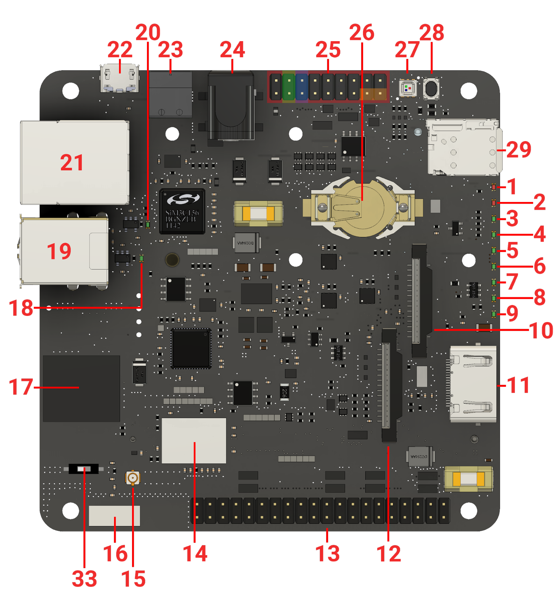

# balena-fin-firmata-flash

This is a balena application that allows to flash the balenaFin Coprocessor with the latest version of the [balenaFin Firmata](https://github.com/balena-io/balena-fin-coprocessor-firmata). For more information about Firmata, check out the official [repo](https://github.com/firmata/protocol). **This currently supports the balenaFin v1.0** (v1.1 will soon be supported as well).

### Getting started

1. Setup your balena account and push to your application following the [getting started](https://www.balena.io/docs/learn/getting-started/fincm3/python/#account-setup) guide.
2. Check the balenaCloud terminal for your application to see if your device has successfully connected and flashed the bootloader & firmata application for the Coprocessor.

### Checking Firmata is working correctly

The Firmata protocol should correctly output the messages `X ✔ firmware name` and `Y.Z ✔ firmata version` (where `Y` & `Z` are the current supported `MAJOR` & `MINOR` versions of firmata) when the balena application has been successfully started.

After starting, the balena application will perform a digital and analogue I/O test to validate that the pins are behaving correctly. Please note, you should not have any devices connected to the USB hub during the test.

In order to complete the tests connect jumper wires across the following pins:

|         |     Pin A      |       Pin B        |
|---------|----------------|--------------------|
| Digital |       2        |         1          |
| Analog  |       4        |         3          |
| LED*    | 14 -> (+) LED  |   (-) LED -> GND   |


**Note - you may wish to use a resistor in series with the LED to help protect it.*

These are indicated by the `EXP` header (#25) on the board shown below. Green:*digital*, blue:*analog* and orange:*LED*.



If everything is running correctly, the console will print that the tests have started and if you connected an LED, it will start blinking. You might see pin values appear a couple of times as the tests complete as debounce can cause the pin values to fluctuate. Additionally the ANALOG_IN test will take a few seconds to complete as the ANALOG_OUT pin ramps its voltage up to max after each successful read.

```bash
Checking Firmata version...
StandardFirmata  ✔ firmware name
2.5              ✔ firmata version
balenaFin        ✔ ready
Starting DIGITAL I/O check...
Starting ANALOG I/O check...
DIGITAL_IN | Pin 4 : | Value 1
ANALOG_IN  | Pin 2 : | Value 2661
All checks passed ✔
```
Once all the checks have passed, the application will exit.

### Using Firmata

If everything was successful your balenaFin's Coprocessor is now running  Firmata! You can use this with a range of languages that support the Firmata protocol (Python, nodejs, etc.). Check the [balenaFin Firmata](https://github.com/balena-io/balena-fin-coprocessor-firmata) repository for more information about the currently supported features and additional commands.
